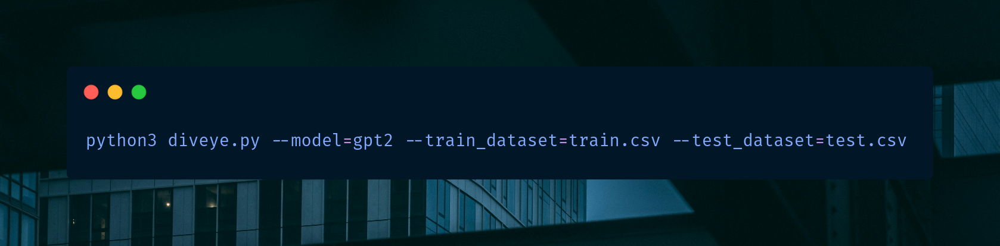

# DivEye

This repo is an official implementation of DivEye for the paper *Diversity Boosts AI-Generated Text Detection* (accepted @ ICML, Data in Generative Models (DIG-BUG) '25). 

Official website for DivEye for demos & examples: https://diveye.vercel.app/

Detecting AI-generated text is an increasing necessity to combat misuse of LLMs in domains such as education, business compliance, journalism, and social media, where synthetic fluency can mask misinformation or deception. Existing detectors often rely on likelihood-based heuristics  or black-box classifiers, which struggle against high-quality generations and lack interpretability. In this work, we propose DivEye, a novel detection framework that captures how unpredictability fluctuates across a text using surprisal-based features. Motivated by the observation that human-authored text exhibits richer variability in lexical and structural unpredictability than LLM outputs, DivEye captures this signal through a set of interpretable statistical features. Our method outperforms existing zero-shot detectors by up to 33.2% and achieves competitive performance with fine-tuned baselines across multiple benchmarks. DivEye is robust to paraphrasing and adversarial attacks, generalizes well across domains and models, and improves the performance of existing detectors by up to 18.7% when used as an auxiliary signal. Beyond detection, DivEye provides interpretable insights into why a text is flagged, pointing to rhythmic unpredictability as a powerful and underexplored signal for LLM detection.

---
## 1. Installation
- Clone this repository to your local machine.
- Install conda and run the following commands to set up your environment.
```bash
conda create -n diveye python=3.11
conda activate diveye
pip install transformers scikit-learn tqdm numpy pandas xgboost scipy
```

## 2. Execution
You can run the code using the following command:
```bash
python3 diveye.py --model={model} --train_dataset={train_dataset.csv} --test_dataset={test_dataset.csv}
```

For more details about the arguments, please refer to the table below:
| **Argument**      | **Default / Choices**                                                                                   | **Explanation**                                                                                                                                                                                                                                           |
|-------------------|---------------------------------------------------------------------------------------------------------|-----------------------------------------------------------------------------------------------------------------------------------------------------------------------------------------------------------------------------------------------------------|
| `--model`  | **Required** <br> The model must be available on HuggingFace to be used. | Specifies the model for feature extraction in DivEye. |
| `--train_dataset` | **Required** <br> *Format:* `{name}.csv` | Indicates the training dataset. |
| `--test_dataset`  | **Required** <br> *Format:* `{name}.csv` | Indicates the testing dataset.  |

## 3. License
Our source code is under the [CC BY-NC-SA 4.0](https://creativecommons.org/licenses/by-nc-sa/4.0/).

## 4. Authors & Citation
- [Advik Raj Basani](https://github.com/FloofCat)
- [Pin-Yu Chen](https://github.com/pinyuchen)

If you find DivEye useful, please cite our paper:
```
@inproceedings{
    diveye25,
    title={Diversity Boosts {AI}-Generated Text Detection},
    author={Advik Raj Basani, Pin-Yu Chen},
    booktitle={Data in Generative Models - The Bad, the Ugly, and the Greats},
    year={2025},
    url={https://openreview.net/forum?id=QuDDXJ47nq}
}
```